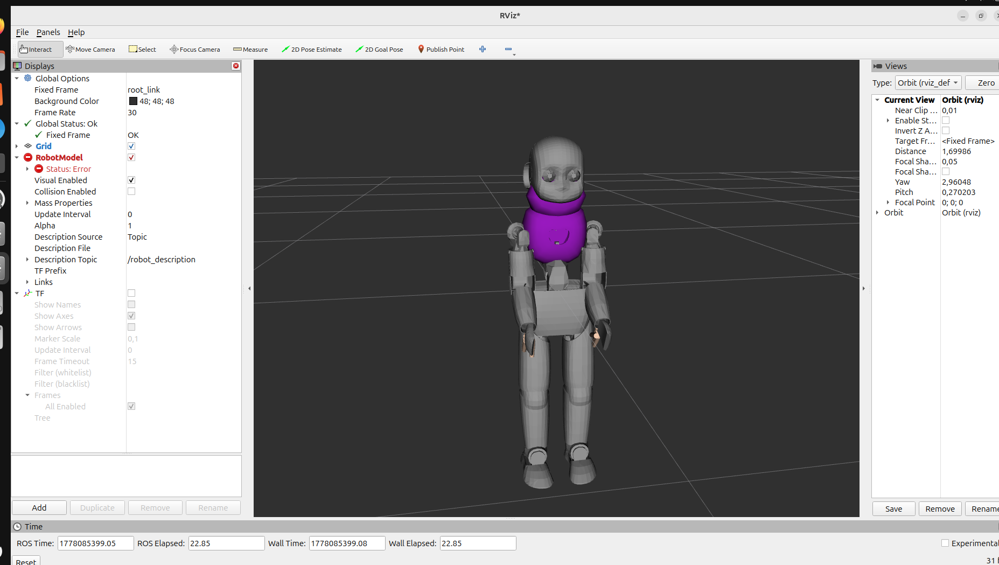

🤖 iCub Humanoid Robot - ROS 2 Jazzy

Ce package contient la description URDF et les outils de visualisation pour le robot humanoïde iCub. Ce modèle est optimisé pour la simulation et la visualisation dans l'écosystème ROS 2.
📸 Aperçu du Robot

🛠 Installation & Compilation

Suivez ces étapes pour préparer votre environnement de travail :
# Accéder au workspace
cd ~/ros2_ws

# Compiler le package avec les liens symboliques (pratique pour l'URDF)
colcon build --symlink-install

# Sourcer l'installation
source install/setup.bash

🚀 Lancement de la Visualisation

Pour lancer le robot dans RViz avec le joint_state_publisher_gui (pour manipuler les membres) :
ros2 launch humanoid_robot display.launch.py

Structure du Package

    urdf/ : Contient le fichier XML décrivant la structure cinématique (links, joints, materials).

    meshes/ : Fichiers .dae (Collada) utilisés pour le rendu visuel détaillé.

    launch/ : Scripts Python pour démarrer les nœuds robot_state_publisher et rviz2.

⚙️ Détails Techniques (URDF)
This project was co-authored and implemented by the team: Amira Malak Daoui, Maria Lagab

Le modèle définit une hiérarchie complexe respectant les standards de l'iCub :

    Torse : 3 degrés de liberté (Pitch, Roll, Yaw).

    Membres Supérieurs : Épaules, coudes et mains avec doigts détaillés (Index, Middle, Ring, Pinky, Thumb).
    
   Membres Inférieurs : Hanches, genoux et chevilles équipés de capteurs de force/couple (FT sensors).
   Amira, [May 11, 2026 at 21:52]
This project was co-authored and implemented by the team: Amira Malak Daoui, Maria Lagab, and Romaissa Athmani.

    Matériaux : Définition des couleurs red, grey, white, dark, skin, et black.
